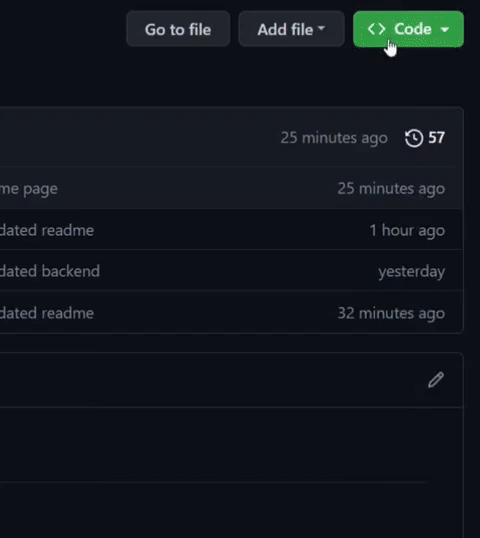
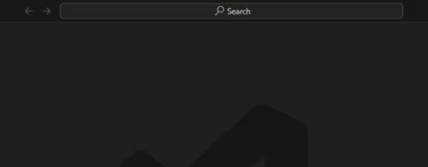
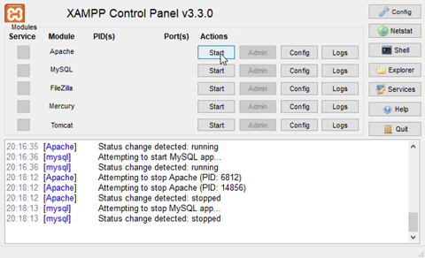
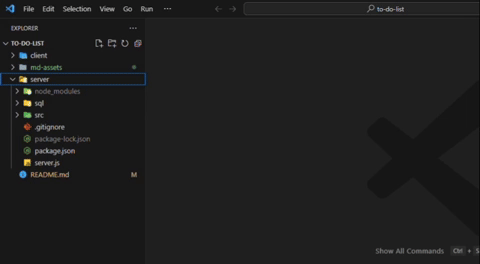
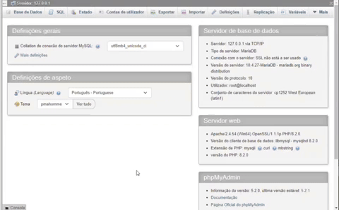
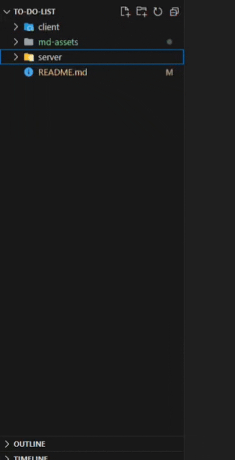
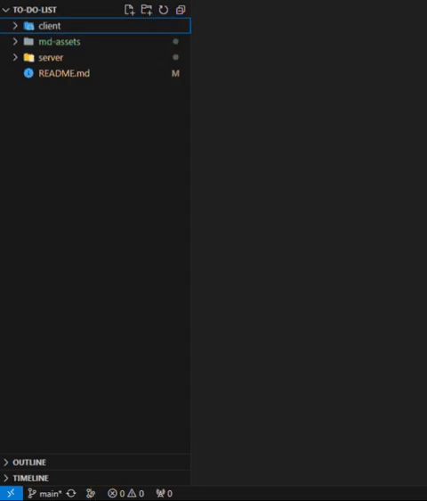

# TO DO LIST

## Instruções

Requisitos:
- [x] [VSCode](https://code.visualstudio.com/download)
- [x] [Node.js](https://nodejs.org/en/download)
- [x] [XAMPP Control Panel](https://www.apachefriends.org/download.html)
- [x] Extensão [Live Server](https://marketplace.visualstudio.com/items?itemName=ritwickdey.LiveServer) no VSCode

    > Hiperlinks redirecionam para as páginas de download

### Clonar Repositório

- Copia o link do repositório

    

- Clica no botão ao lado do link pra copiá-lo
- No VSCode, aperta as teclas `CTRL + SHIFT + P`
- Digita

        git clone

- Seleciona `Git: Clone`
- Cola o link do repositório
- `Enter`

    

- Escolha um local para clonar o repositório

### Inicializar o Backend
- Abre o **XAMPP Control Panel**
- Clica em **Start** no Apache e MySQL
- Clica em **Admin** no MySQL

    

- No VSCode, abra a pasta **./server/sql**
- Abra o arquivo **script.sql**
- Copia o script

    

- No phpMyAdmin, clica em **SQL**
- Cola o script no campo em branco
- Aperta `CTRL + ENTER`

    

- No VSCode, clica com o botão direito na pasta **server**
- Clica em **Open in Integrated Terminal**

    

Quando o Terminal abrir
- Para instalar as dependências do projeto, digite

        npm i
        
- Para instalar o nodemon, digite

        npm i nodemon
        
- Para rodar o Backend, digite 

        nodemon
        
## Abrir o projeto

Para ver o projeto em funcionamento
- Abra a pasta **./client/login**
- Clica com o botão direito no arquivo **index.html**
- **Open with Live Server**

    

#

## Créditos

- [Todo App Frontend Mentor Challenge](https://www.frontendmentor.io/challenges/todo-app-Su1_KokOW)
- [Ícones](https://www.flaticon.com/br/)
- [Home Wallpaper by Dids](https://www.pexels.com/photo/photo-of-abstract-painting-3527795/)