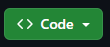
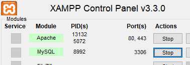
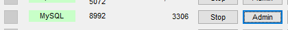
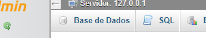

# TO DO LIST

## Instruções

Necessário ter instalado:
- [VSCode]()
- [Node.js](https://nodejs.org/en/download)
- [XAMPP Control Panel](https://www.apachefriends.org/download.html)
- Extensão [Live Server](https://marketplace.visualstudio.com/items?itemName=ritwickdey.LiveServer) no VSCode

> Hiperlinks redirecionam para as páginas de download respectivas

### Clonar Repositório

- Clica em 




- Clica no botão ao lado do link pra copiá-lo

No VSCode:
- Aperta as teclas `CTRL + SHIFT + P`
- Digita

```
git clone
```

- Seleciona `Git: Clone`
- Copia e cola o link do repositório
- Aperta `Enter` 
- Escolha um local para clonar o repositório

### Inicializar o projeto
- Abre o **XAMPP Control Panel**
- Clica em **Start** no Apache e MySQL



- Clica em **Admin** no MySQL



No phpMyAdmin
- Clica em **SQL**



No VSCode
- Na pasta **./server/sql** terá o arquivo **script.sql**
- Abra o arquivo, copia o script
- Volta para o phpMyAdmin e cola no campo em branco
- Aperta `CTRL + ENTER`

No VSCode
- Clica com o botão direito na pasta **server**
- Clica em **Open in Integrated Terminal**

Quando o Terminal abrir
- Pra instalar as dependências, digite

```
npm i
```

- Pra instalar o nodemon, digite

```
npm i nodemon
```

- Depois disso, digite

```
nodemon
```

## Abrir o projeto

Para ver o projeto em funcionamento
- Abra a pasta **./client/login**
- Clica com o botão direito no arquivo **index.html**
- **Open with Live Server**


#

## Bibliografia

#### Inspiração
- [Todo App Frontend Mentor Challenge](https://www.frontendmentor.io/challenges/todo-app-Su1_KokOW)

#### Ícones
- [Favicon](https://www.flaticon.com/br/icone-gratis/verificacao-da-lista-da-area-de-transferencia_8270234?term=check&page=1&position=1&origin=search&related_id=8270234)
- [Return Icon](https://www.flaticon.com/br/icone-gratis/brilho-do-sol_5311069?term=sol&page=1&position=1&origin=search&related_id=5311069)

#### Imagens
- [Home Wallpaper by Dids](https://www.pexels.com/photo/photo-of-abstract-painting-3527795/)